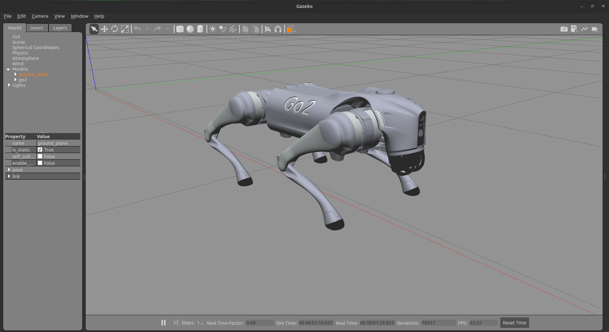

# unitree go2 description - ros2 humble

> This package contains the robot description files for the Unitree Go2 robot to be configured with the CHAMP controller in ROS 2 (humble). It includes development of robot description model for ROS 2 Humble distribution build over [unitree_ros](https://github.com/unitreerobotics/unitree_ros) package.

## Unitree Go2:
<div style="display: flex; gap: 50px;">
  
   
</div>

</br>

> Unitree Robotics is focusing on the R&D, production, and sales of consumer and industry-class high-performance general-purpose legged and humanoid robots, six-axis manipulators, and so on. We attaches great importance to independent research and development and technological innovation, fully self-researching key core robot components such as motors, reducers, controllers, LIDAR and high-performance perception and motion control algorithms, integrating the entire robotics industry chain.

## Resources:
- [go2 description (URDF model)](https://github.com/unitreerobotics/unitree_ros/tree/master/robots/go2_description) 

## Tested on:
- Ubuntu 22.04 (ROS2 Humble)

## Current state of package:

- &check; Robots Configurations.
    - &check; Porting of robot description packages to ROS 2.
    - &check; Porting of robot URDF to ROS2 (add new ros2_control tag).
    - &check; Porting of robot configurationf to ROS2.
    - &check; Porting of robot launch Files to ROS2.
- &check; Upgrade go2 description model for ros2 humble
- &check; Spawning go2 in gazebo environment. (launch using go2 config from champ)
- &check; Working rviz only demo. (launch using go2 config from champ)
- &check; Working Gazebo with teleoperated robot. (launch using go2 config from champ)
- &cross; Adding IMU
- &cross; Adding 2D LaserScan
- &cross; Adding Intel Realsense Depth Camera

## 1. Installation

### 1.1 Clone and install all dependencies:
    
```bash
sudo apt install -y python3-rosdep
rosdep update

cd <your_ws>/src
git clone https://github.com/anujjain-dev/go2_description.git -b ros2/humble
cd <your_ws>
rosdep install --from-paths src --ignore-src -r -y
```

### 1.2 Build your workspace:
```bash
cd <your_ws>
colcon build
. <your_ws>/install/setup.bash
```

## Contributing

Contributions are welcome! Please feel free to submit a Pull Request.

1. Fork the repository
2. Create your feature branch (`git checkout -b feature/AmazingFeature`)
3. Commit your changes (`git commit -m 'feat: Add some AmazingFeature'`)
4. Push to the branch (`git push origin feature/AmazingFeature`)
5. Open a Pull Request

## Acknowledgements

This project builds upon and incorporates work from the following projects:

* [Unitree Robotics](https://github.com/unitreerobotics/unitree_ros) - For the Go2 robot description (URDF model).
* [CHAMP](https://github.com/chvmp/champ) - For the quadruped controller framework.
* [CHAMP Robots](https://github.com/chvmp/robots) - For robot configurations and setup examples.

We are grateful to the developers and contributors of these projects for their valuable work.